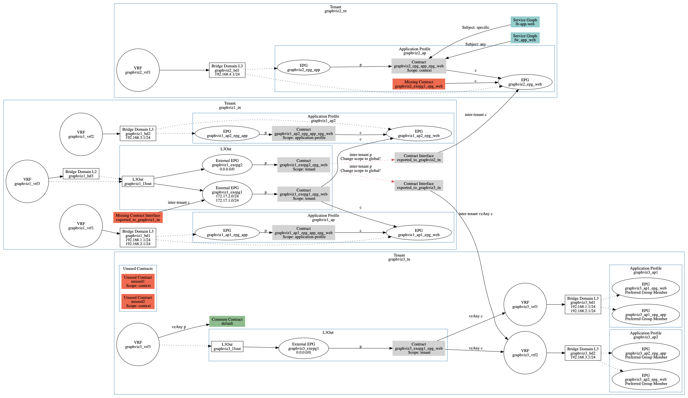

# Graphviz Cobra

Generate diagrams from running Cisco ACI Fabrics.

## Description

This tool is a Python3 script that:
- Initiates a connection to a running Cisco ACI Fabric
- Queries each Tenant
- Plots ACI Managed Objects (Objects for short) and their associations to each other

The tool supports Password-based and Certificate-based authentication to the Cisco ACI Fabric. Certificate-based authentication takes precedence if both are attempted simultaneously.

## Use Cases

Diagrams produced by this tool will help to:
- Reveal Object relations within the Tenant and between the Tenants
  * To simplify troubleshooting
  * To sparkle ideas how to optimise the configuration
- Visually document current configurational state of the Fabric
- Sort out Contracts:
  * Reveal unused Contracts
  * Reveal wrongly configured Contract Scopes
  * Visually figure out required Scope for the Contract (e.g. consumed only within the AP)
- Spot unused Objects (e.g. VRFs, BDs)
- Reveal missing links between objects (e.g. L3Out to VRF or BD)

## Prerequisites

The tool depends on:
- [Cobra](https://github.com/datacenter/cobra)
- [pyGraphviz](https://github.com/pygraphviz/pygraphviz)
- [Graphviz](https://www.graphviz.org/)

Make sure you have these installed before attempting to run the script on your system.

## Usage

You can run the tool native on your system.
Or, to avoid dealing with dependencies, you can run the tool in a Docker Container that we [maintain](docker/README.md).

```
aci-graphviz-cobra.py
              [-h]
              [-u [admin]] [-p [pass31339]]
              [-a [https://169.254.1.1]]
              [-t [example_tn1 example_tn2 ...]
              [-o out.png]
              [-vv]
              [-k [user.key]]
              [-c [uni/userext/user-cisco/usercert-cisco_crt]]
```

### Usage examples:
```
python aci-graphviz-cobra.py
```
```
python aci-graphviz-cobra.py \
-a https://169.254.1.1 -u admin -p pass31339 \
-t graphviz1_tn graphviz3_tn graphviz2_tn
```
```
python aci-graphviz-cobra.py \
-a https://169.254.1.1 -c uni/userext/user-admin/usercert-admin_crt -k admin.key \
-t graphviz1_tn graphviz3_tn graphviz2_tn
```

After the successful run find your diagram in ```/out``` subdirectory.

### All arguments are optional:
- APIC URL           
```
-a https://169.254.1.1
--apic https://169.254.1.1
```
- User name for Password-based authentication
```
-u admin
--user admin
```
- Password for Password-based authentication
```                
-p pass31339
--password pass31339
```
- Tenants to be included in the diagram (all Tenants by default)
```
-t example_tn1 example_tn2 ...
--tenant example_tn1 example_tn2 ...
```
- Output file name (out.png by default)
```
-o out.png
--output out.png
```
- Private key file for Certificate-based authentication
```
-k user.key
--keyfile user.key
```
- Certificate DN for Certificate-based authentication
```
-c uni/userext/user-cisco/usercert-cisco_crt
--certdn uni/userext/user-cisco/usercert-cisco_crt
```
- Verbose
```
-vv, --verbose
```

## Example Diagrams




Legend:
- Red = Object requires attention
- Green = Object belongs to Tenant Common
- c = Consumed Contract
- p = Provided Contract

## Supported Objects

Tenant, VRF, BD, BD Subnet, Application Profile, Application EPG, L3Out, External EPG, Standard Contracts, Contract Scopes, Contract Interfaces, vzAny, EPG Preferred Group, Tenant Common.

## ToDo

- [ ] Add Taboo Contracts
- [ ] Add L2Out
- [X] Add Service Graph Template
- [ ] Add Service Graph Template Export + PBR
- [ ] Add subnet scope for BD
- [ ] Add domain-centric Fabric mode
- [ ] Comprehensive prints on every step e.g. Plot BD-X
- [ ] If some object is missing but relation is present, flag it (like with missing contracts)
- [X] See if there's better way to implement: i = ctrctIf.tDn.rfind("/cif-")+5
- [ ] If number of objects is more than 200 suggest splitting into Tenants
- [X] Add MSO notification if a Tenant is MSO-managed

## Author

[**Vasily Prokopov**](https://github.com/vasilyprokopov)

## License

See the [LICENSE](LICENSE) file for details.

## Inspired by

[github.com/cgascoig/aci-diagram](https://github.com/cgascoig/aci-diagram)
